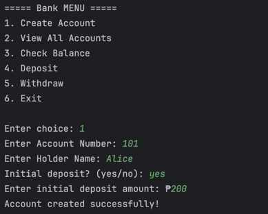
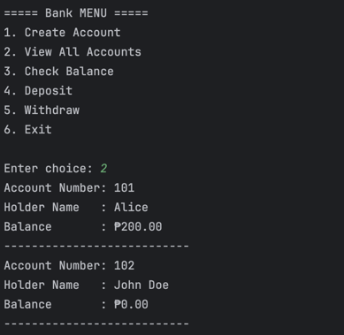
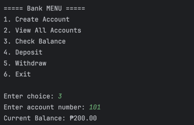
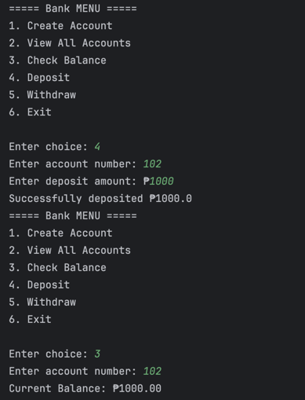
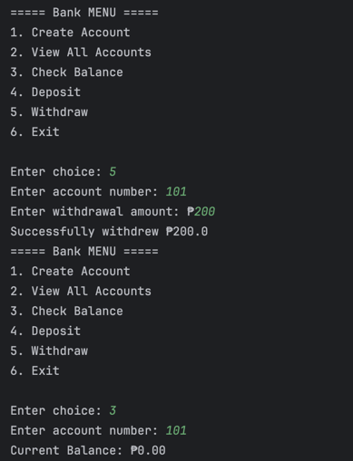
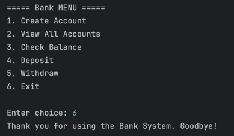

## Lab 1: Build a Java Bank Account System
Design and build a menu-driven Java application that simulates basic banking operations using OOP principles.

Define a class named BankAccount that will contain:
- Account Number
- Bank Account Holder Name
- Available Balance

Methods:
- Deposit: Adds to balance (with error check)
- Withdraw: Subtracts from balance (with error check)
- Display Information:Prints account info 
- Get Account Number: Returns account number (used for searching)

## Sample Output

### Create Account

### View All Accounts

### Check Balance

### Deposit

### Withdraw

### Exit

